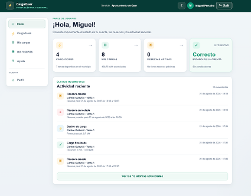
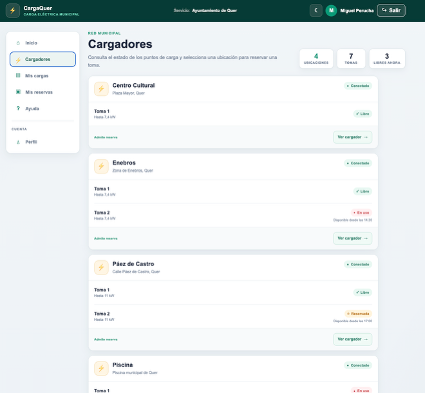
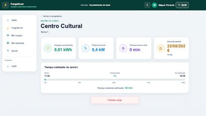
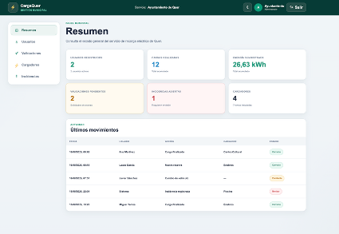

# ⚡ CargaQuer

**CargaQuer** es una aplicación web para la gestión de reservas y sesiones de carga de vehículos eléctricos en puntos de carga municipales.

El proyecto nace a partir de una situación real: la necesidad de organizar el uso compartido de cargadores públicos cuando varios usuarios necesitan utilizar las mismas tomas.

La aplicación plantea una solución sencilla para que los vecinos puedan consultar los cargadores disponibles, reservar una toma, iniciar su sesión de carga y consultar posteriormente su actividad, mientras que la administración dispone de herramientas para gestionar usuarios, cargadores e incidencias.

> Proyecto desarrollado como aplicación web completa, desde el diseño de la interfaz hasta la integración con backend, base de datos y automatizaciones.

### 🌐 Demo

La aplicación está desplegada en Netlify y puede probarse desde:

👉 **[Abrir CargaQuer](https://cargaquer.netlify.app/)**

---

## 🎯 ¿Qué problema intenta resolver?

Cuando varios usuarios utilizan los mismos cargadores municipales pueden aparecer situaciones como:

- No saber si una toma está disponible.
- Coincidir varios vehículos en el mismo cargador.
- No conocer durante cuánto tiempo estará ocupado.
- Tener que organizar los turnos de forma manual.
- No disponer de un historial de utilización.
- Dificultad para gestionar usuarios e incidencias desde la administración.

**CargaQuer centraliza este proceso en una única aplicación.**

El usuario puede reservar previamente una franja horaria y consultar el estado de los cargadores antes de desplazarse hasta ellos.

---

## ⚡ Funcionamiento

El flujo principal de utilización es sencillo:

**Cargador → Toma → Reserva → Carga → Histórico**

El usuario puede consultar los diferentes puntos de carga y comprobar el estado de sus tomas.

Una vez seleccionada una toma puede reservar una franja disponible, con intervalos de 30 minutos y una duración máxima de 4 horas.

Cuando llega el momento de la reserva puede iniciar la carga y consultar durante la sesión información como:

- Tiempo transcurrido.
- Energía suministrada.
- Potencia actual.
- Hora prevista de finalización.
- Tiempo restante.
- Progreso de la sesión.

Al finalizar, la sesión pasa automáticamente al histórico de cargas.

---

## 🖥️ Vista general



El panel principal permite consultar rápidamente el estado de la cuenta, las próximas reservas, la actividad reciente y acceder a las principales funciones de la aplicación.

---

## 🔌 Gestión de cargadores y reservas



Los usuarios pueden consultar los cargadores municipales, acceder a cada una de sus tomas y comprobar su disponibilidad antes de realizar una reserva.

El sistema controla los horarios ocupados, los solapamientos y las reservas existentes para evitar que dos usuarios puedan reservar la misma toma durante el mismo periodo.

---

## 🔋 Sesiones de carga



Durante una sesión activa se muestra la información principal de la carga y su evolución.

Las sesiones pueden finalizarse manualmente o alcanzar automáticamente su hora prevista de finalización.

Una vez terminadas quedan registradas en **Mis cargas**, permitiendo mantener un histórico de utilización y calcular estadísticas de consumo y tiempo.

---

## 🛡️ Administración



CargaQuer también dispone de un área independiente para la administración del servicio.

Desde ella es posible consultar y gestionar:

- Usuarios.
- Solicitudes de alta.
- Cargadores y tomas.
- Incidencias.
- Estadísticas de utilización.
- Consumo energético.
- Actividad reciente.

Los nuevos usuarios pasan por un proceso de validación antes de poder acceder al servicio.

---

## 🧩 Arquitectura

La aplicación está organizada separando las diferentes responsabilidades del proyecto:

```text
Frontend
   │
   │ React + TypeScript
   ▼
Servicios de la aplicación
   │
   │ Supabase JavaScript Client
   ▼
Supabase
   ├── Authentication
   ├── PostgreSQL
   ├── RPC / funciones SQL
   └── Edge Functions
          │
          ▼
     Automatizaciones

---

## 👨‍💻 Autor

Proyecto desarrollado por **Miguel Ángel Perucha Castelló**.

🌐 [Portfolio](https://mapdev-portfolio.netlify.app/)  
💼 [LinkedIn](https://www.linkedin.com/in/miguel-%C3%A1ngel-perucha-castell%C3%B3)

Espero que CargaQuer resulte interesante. Cualquier comentario, sugerencia o feedback sobre el proyecto es bienvenido.